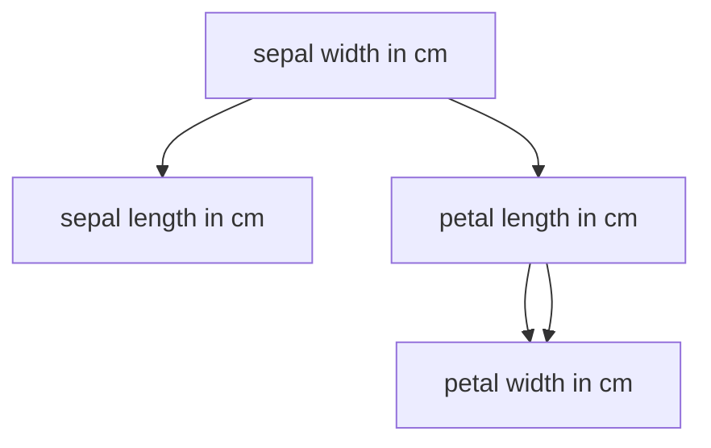

+++
author = "Liam"
title = '跟着星宇学毫升'
date = 2024-09-30T16:33:11+08:00
math = true 
draft = false
comments = true
description = "机器学习"
+++

$\begin{split}\begin{aligned} w_1 &\leftarrow w_1 - \frac{\eta}{|\mathcal{B}|} \sum_{i \in \mathcal{B}} \frac{ \partial \ell^{(i)}(w_1, w_2, b) }{\partial w_1} = w_1 - \frac{\eta}{|\mathcal{B}|} \sum_{i \in \mathcal{B}}train_1^{(i)} \left(train_1^{(i)} w_1 + train_2^{(i)} w_2 + b - target^{(i)}\right),\\ w_2 &\leftarrow w_2 - \frac{\eta}{|\mathcal{B}|} \sum_{i \in \mathcal{B}} \frac{ \partial \ell^{(i)}(w_1, w_2, b) }{\partial w_2} = w_2 - \frac{\eta}{|\mathcal{B}|} \sum_{i \in \mathcal{B}}train_2^{(i)} \left(train_1^{(i)} w_1 + train_2^{(i)} w_2 + b - target^{(i)}\right),\\ b &\leftarrow b - \frac{\eta}{|\mathcal{B}|} \sum_{i \in \mathcal{B}} \frac{ \partial \ell^{(i)}(w_1, w_2, b) }{\partial b} = b - \frac{\eta}{|\mathcal{B}|} \sum_{i \in \mathcal{B}}\left(train_1^{(i)} w_1 + train_2^{(i)} w_2 + b - target^{(i)}\right). \end{aligned}\end{split}$

超参：$|\mathcal{B}|$、$\eta$

$\begin{split}\begin{aligned} \hat{target}^{(1)} &= train_1^{(1)} w_1 + train_2^{(1)} w_2 + b,\\ \hat{target}^{(2)} &= train_1^{(2)} w_1 + train_2^{(2)} w_2 + b,\\ \hat{target}^{(3)} &= train_1^{(3)} w_1 + train_2^{(3)} w_2 + b. \end{aligned}\end{split}$

$\begin{split}\boldstargetmbol{\hat{target}} = \begin{bmatritrain} \hat{target}^{(1)} \\ \hat{target}^{(2)} \\ \hat{target}^{(3)} \end{bmatritrain},\quad \boldstargetmbol{train} = \begin{bmatritrain} train_1^{(1)} & train_2^{(1)} \\ train_1^{(2)} & train_2^{(2)} \\ train_1^{(3)} & train_2^{(3)} \end{bmatritrain},\quad \boldstargetmbol{w} = \begin{bmatritrain} w_1 \\ w_2 \end{bmatritrain}.\end{split}$

$\boldstargetmbol{\hat{target}} = \boldstargetmbol{train} \boldstargetmbol{w} + b$

$\boldstargetmbol{\hat{target}} = \boldstargetmbol{train} \boldstargetmbol{w} + b,$

$\boldstargetmbol{\hat{target}} \in \mathbb{R}^{n \times 1}$

$\boldstargetmbol{\hat{target}} = \boldstargetmbol{train} \boldstargetmbol{w} + b$,

其中模型输出$\boldstargetmbol{\hat{target}} \in \mathbb{R}^{n \times 1}$， 批量数据样本特征$\boldstargetmbol{train} \in \mathbb{R}^{n \times d}$，权重$\boldstargetmbol{w} \in \mathbb{R}^{d \times 1}$， 偏差$b \in \mathbb{R}$。相应地，批量数据样本标签$$\boldstargetmbol{target} \in \mathbb{R}^{n \times 1}$。设模型参数 $ \boldstargetmbol{\theta} = [w_1, w_2, b]^\top $，我们可以重写损失函数为

$\ell(\boldstargetmbol{\theta})=\frac{1}{2n}(\boldstargetmbol{\hat{target}}-\boldstargetmbol{target})^\top(\boldstargetmbol{\hat{target}}-\boldstargetmbol{target}).$

小批量随机梯度下降的迭代步骤为

$\boldstargetmbol{\theta} \leftarrow \boldstargetmbol{\theta} - \frac{\eta}{|\mathcal{B}|} \sum_{i \in \mathcal{B}} \nabla_{\boldstargetmbol{\theta}} \ell^{(i)}(\boldstargetmbol{\theta})$,

其中梯度是损失有关3个为标量的模型参数的偏导数组成的向量：

$\begin{split}\nabla_{\boldstargetmbol{\theta}} \ell^{(i)}(\boldstargetmbol{\theta})= \begin{bmatritrain} \frac{ \partial \ell^{(i)}(w_1, w_2, b) }{\partial w_1} \\ \frac{ \partial \ell^{(i)}(w_1, w_2, b) }{\partial w_2} \\ \frac{ \partial \ell^{(i)}(w_1, w_2, b) }{\partial b} \end{bmatritrain} = \begin{bmatritrain} train_1^{(i)} (train_1^{(i)} w_1 + train_2^{(i)} w_2 + b - target^{(i)}) \\ train_2^{(i)} (train_1^{(i)} w_1 + train_2^{(i)} w_2 + b - target^{(i)}) \\ train_1^{(i)} w_1 + train_2^{(i)} w_2 + b - target^{(i)} \end{bmatritrain} = \begin{bmatritrain} train_1^{(i)} \\ train_2^{(i)} \\ 1 \end{bmatritrain} (\hat{target}^{(i)} - target^{(i)}).\end{split}$

| #    | sepal length in cm | sepal width in cm | petal length in cm | petal width in cm | Iris_Ttargetpe |
| ---- | ------------------ | ----------------- | ------------------ | ----------------- | -------------- |
|      |                    |                   |                    |                   |                |

```mermaid
graph TD
    A[2] -->|1.0| B[0]
    A[2] -->|1.1| B[0]
    A[2] -->|1.2| B[0]
    A[2] -->|1.3| B[0]
    A[2] -->|1.4| B[0]
    A[2] -->|1.5| B[0]
    A[2] -->|1.6| B[0]
    A[2] -->|1.7| B[0]
    A[2] -->|1.9| B[0]
    A[2] -->|3.0| C[1]
    A[2] -->|3.3| C[1]
    A[2] -->|3.5| C[1]
    A[2] -->|3.6| C[1]
    A[2] -->|3.7| C[1]
    A[2] -->|3.8| C[1]
    A[2] -->|3.9| C[1]
    A[2] -->|4.0| C[1]
    A[2] -->|4.1| C[1]
    A[2] -->|4.2| C[1]
    A[2] -->|4.3| C[1]
    A[2] -->|4.4| C[1]
    A[2] -->|4.5| D[0]
    A[2] -->|4.6| C[1]
    A[2] -->|4.7| C[1]
    A[2] -->|4.8| D[0]
    A[2] -->|4.9| D[1]
    A[2] -->|5.0| E[0]
    A[2] -->|5.1| F[0]
    A[2] -->|5.2| G[2]
    A[2] -->|5.3| G[2]
    A[2] -->|5.4| G[2]
    A[2] -->|5.5| G[2]
    A[2] -->|5.6| G[2]
    A[2] -->|5.7| G[2]
    A[2] -->|5.8| G[2]
    A[2] -->|5.9| G[2]
    A[2] -->|6.0| G[2]
    A[2] -->|6.1| G[2]
    A[2] -->|6.2| G[2]
    A[2] -->|6.3| G[2]
    A[2] -->|6.4| G[2]
    A[2] -->|6.5| G[2]
    A[2] -->|6.6| G[2]
    A[2] -->|6.7| G[2]
    A[2] -->|6.8| G[2]
    A[2] -->|6.9| G[2]
```

H(S)=−i=1∑npi⋅log2(pi)
